# 测试复习

## Testing

### 静态测试-动态测试

按照是否被执行可分为**动态测试**和**静态测试**

- 动态测试：功能确认，接口测试，覆盖率分析，性能分析
- 静态测试：代码检查，静态结构分析，代码质量度量

> 其中黑盒只有动态测试，白盒有静态和动态

按照是否针对系统内部结构和具体实现算法的角度可分为：黑盒，白盒

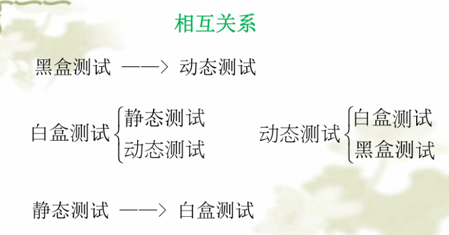

### 黑盒测试

- 等价类：找 if，寻找有效和无效等价类，并且为此设计测试用例

- 边界值分析：基于等价类的条件下，设计测试用例的时候进行采取边界值取法。其中取法规则如下：

  - 一遍边界值：4n + 1（不考虑无效）
  - 一遍边界值的最坏情况：5 的 n 次方
  - 健壮性边界值：6n + 1（考虑无效）
  - 健壮性的最坏情况：7 的 n 次方

  

  

- 判断表：[常用测试用例设计方法 3-判定表法-CSDN 博客](https://blog.csdn.net/weixin_53436351/article/details/123638152)

- 因果图：找原因 -> 找结果，其中原因附带什么条件可以得出什么结果

  - 约束关系：互斥（E），包含（I），唯一（O），要求（R），屏蔽（M）

    

  - 因果关系：恒等，非（~），与和或

    

- 状态图：明确状态节点 -> 绘制迁移图 -> 绘制状态迁移树 -> 抽取测试路径

- 场景法：画流程图 -> 主要事件 -> 备选事件 -> 设计测试用例

后两个更倾向于真实业务测试，也就是功能测试。

> [完美诠释因果图与判定表法 - 知乎 (zhihu.com)](https://zhuanlan.zhihu.com/p/451208514)
>
> [黑盒测试](https://juejin.cn/post/7283797053339353129#heading-9)
>
> [黑盒测试例题](https://blog.csdn.net/Gabbana/article/details/108698502)

### 白盒测试

白盒测试可分为**覆盖测试和基本路径测试**。其中**覆盖测试**有

- 语句覆盖：让每个语句都执行
- 判定覆盖：每个判断都取一次真假，例如 if(a>0 && b>0)，要保证这个 if 的值取满 true 和 false
- 条件覆盖：每个条件，指的是 if 内部的判断取满 true，false。同上例子，要 a 和 b 这两个判断都取满 true，false
- 条件判定覆盖：前两个的合并。所以他是一定包含了前两个的覆盖
- 组合覆盖：条件组合情况，例如上面例子，a>0 和 b>0 的两个判断，这时候就需要他们 true，false 的所有组合
- 路径覆盖：画流程图，每条路都走

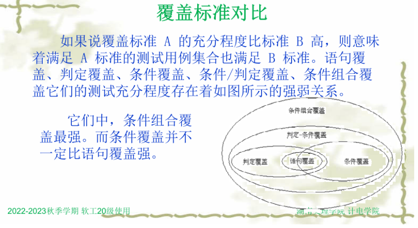

**基本路径测试**

- 圈复杂度：判断节点 + 1，区域的个数，边 - 节点 + 2
- 使用步骤：
  1. 画控制图：先画流程图 -> 控制流图
  2. 计算圈复杂度：这个说明需要多少个测试用例
  3. 导出测试用例：按照路径给予测试用例
  4. 写测试用例

> [基本路径测试](https://blog.csdn.net/XU_MAN_/article/details/102963251)
>
> [覆盖率计算](https://zhuanlan.zhihu.com/p/43007988)

z 路径覆盖：对于循环体，只考虑执行 0 次和 1 次的情况

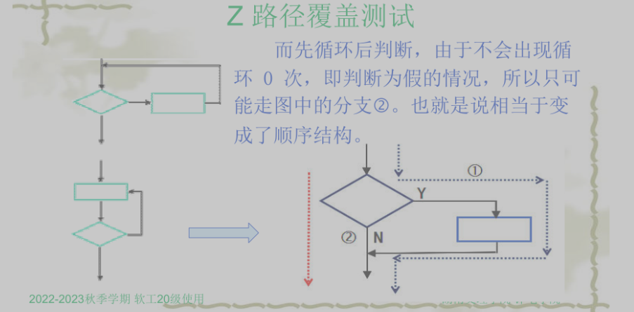

### 集成测试

- [集成测试\_维维 sanguine 的博客-CSDN 博客](https://blog.csdn.net/weixin_45459356/article/details/117034268?app_version=6.1.4&code=app_1562916241&csdn_share_tail={"type"%3A"blog"%2C"rType"%3A"article"%2C"rId"%3A"117034268"%2C"source"%3A"2301_80250292"}&uLinkId=usr1mkqgl919blen&utm_source=app)
- [集成测试之自顶向下、自底向上、三明治集成-阿里云开发者社区 (aliyun.com)](https://developer.aliyun.com/article/1102979)

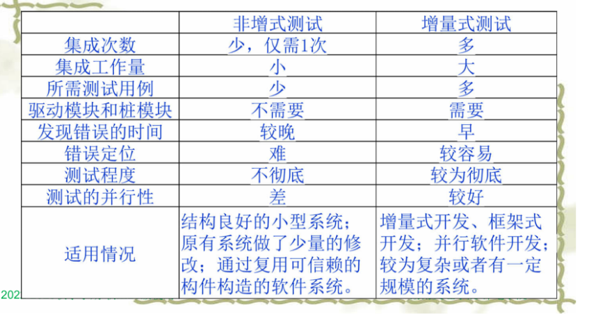

### 控制流图-白盒测试

1. 将流程图简化为控制流图时，在选择或者多分支结构中，分支的汇聚处应有一个汇聚节点

2. 一个判断是多条件的复合表达式的时候，需要改为多分支单条件

   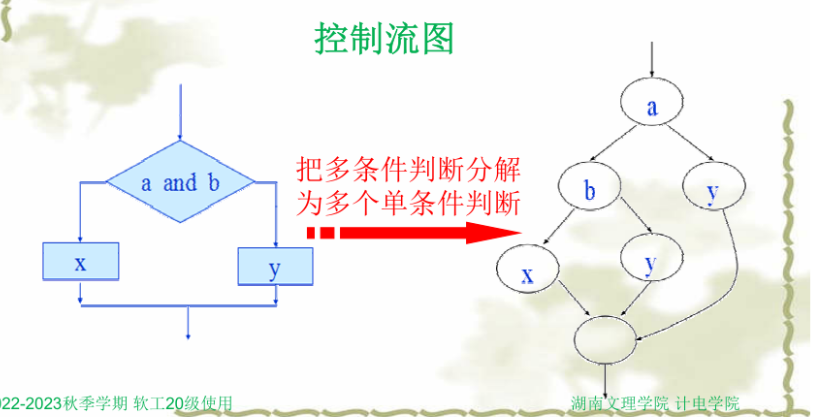

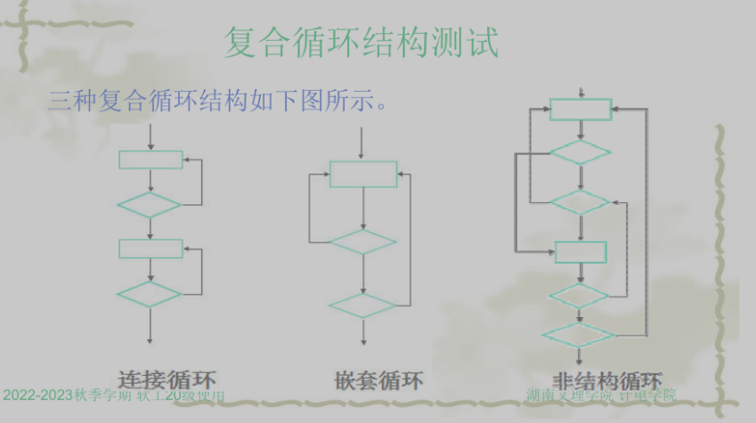

> [基本路径测试复合表达式转化例题](https://blog.csdn.net/qq_42944594/article/details/121929059)

---

## SQA

### 软件质量控制基本概念

- 软件质量控制是软件质量管理的**指向器**和**原动力**
- 软件质量管理是软件质量控制的执行机构

- 质量控制承担了两个方面的度量：
  - 度量与计划和定义开发过程中的一致性
  - 度量产品或阶段性产品是否达到了质量要求

### 第一类测试和第二类测试

- 第一类测试：验证软件是工作的，也就是说是按照预先设计的执行
- 第二类测试：验证软件是不工作的 be

本质区别：验证的目的不一样

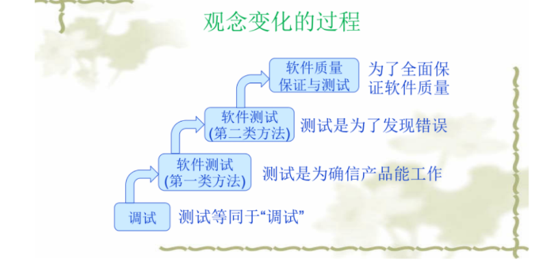

### 软件缺陷

- 软件出错
- 软件功能没满足需求
- 软件功能多余
- 软件未达到指定的目标
- 软件不好用

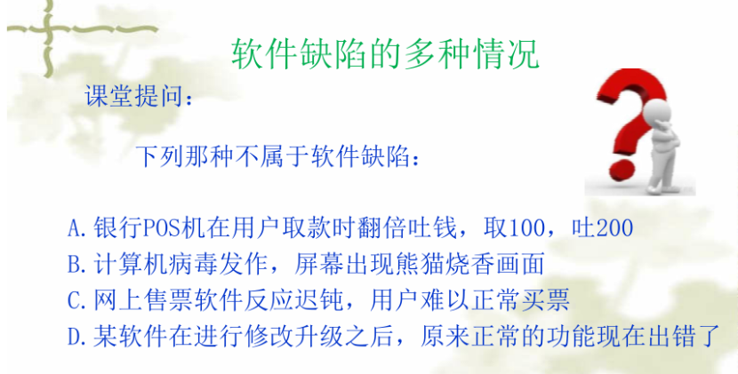

### PIE 模型：传播（Propagation）-感染（Infection）-执行（Execution）

相关概念：

- 缺陷（Fault）：静态存在于代码中的错误行
- 错误（Error）：执行错误代码后导致内部错误。也就是报错
- 失败（Failure）：错误状态被捕获了，并且提供了给外部

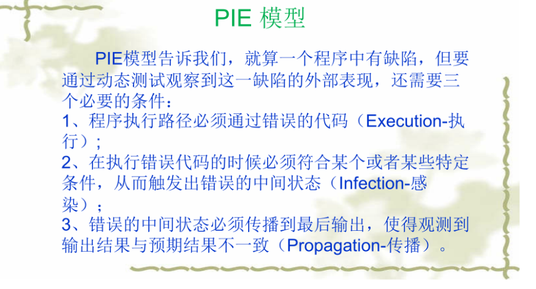

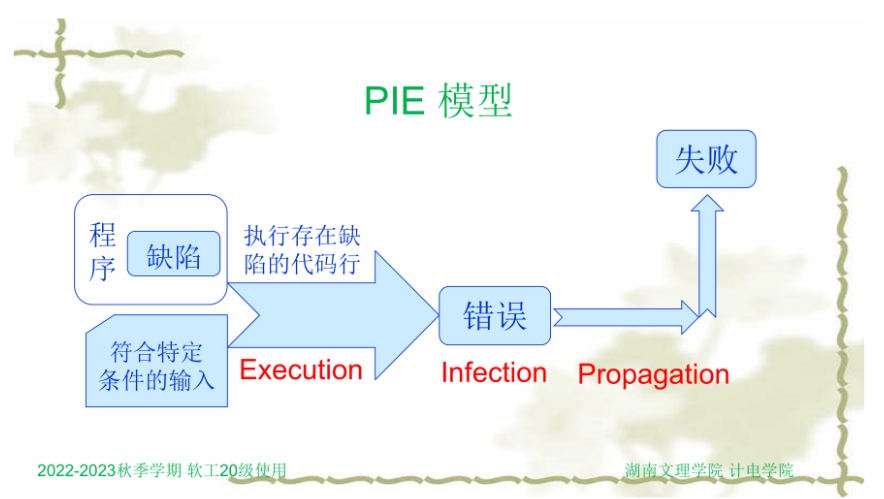

### 软件测试模型

#### V 模型

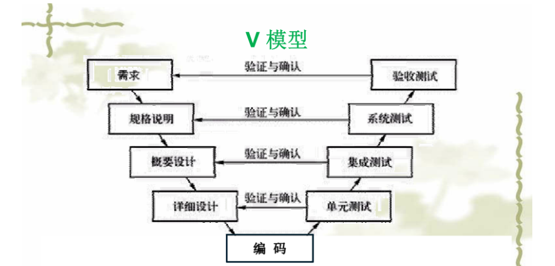

#### [W 模型](https://zhuanlan.zhihu.com/p/56673435)

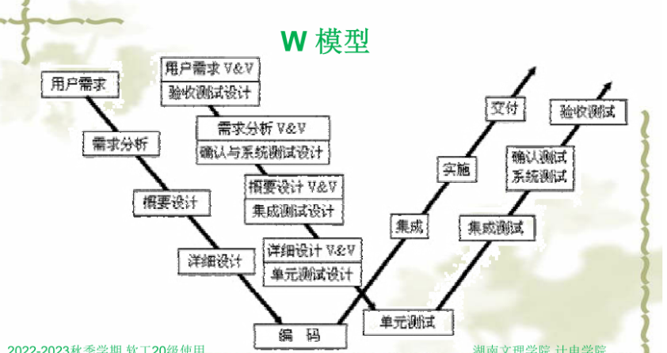

### 测试阶段

- 单元测试：针对代码的测试，函数的输入输出是否符合需求。模块的测试
- 集成测试：基于单元测试结束后，按照设计进行组装测试，测试各个模块连接是否有问题
- 系统测试：检查软件产品是否与系统的其他部分协调工作。比如操作系统，硬件等待，是否性能达标
- 验收测试：从用户的角度进行测试，是否符合用户的要求
  - Alpha 版本：用户在开发环境下进行的测试
  - Beta 版本：用户在用户环境下进行的测试
  - 有 α 和 β 两种测试方法

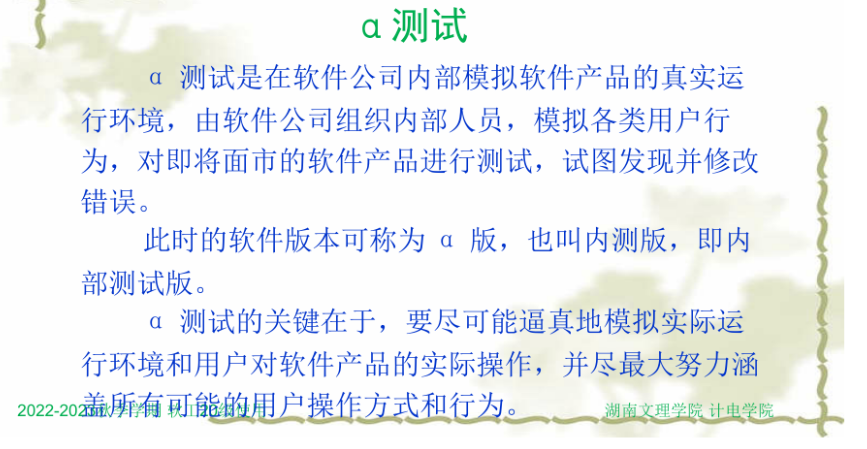

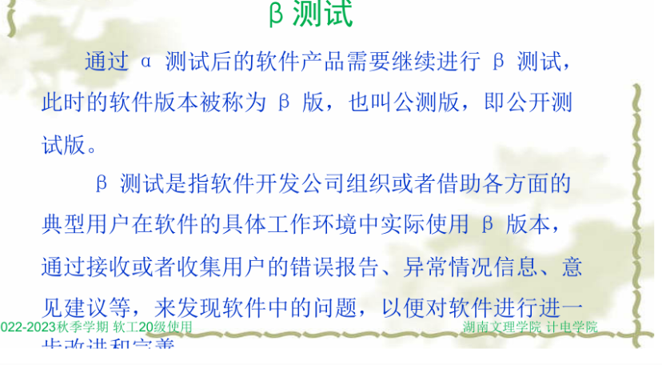

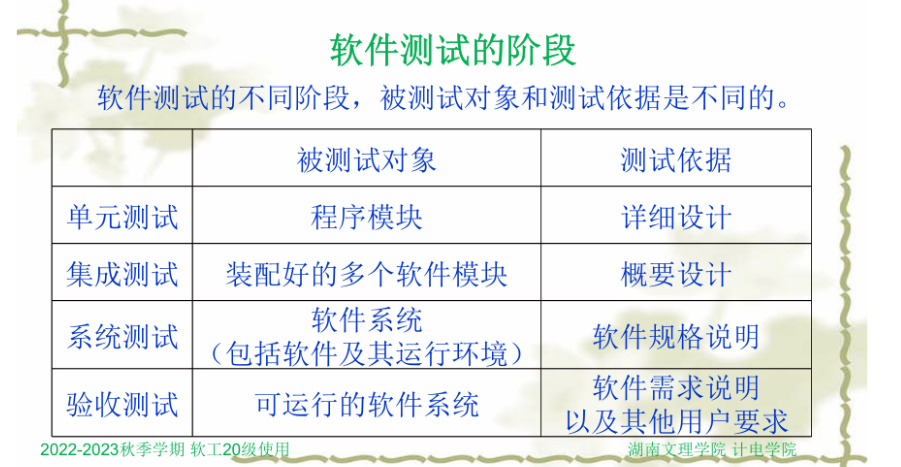

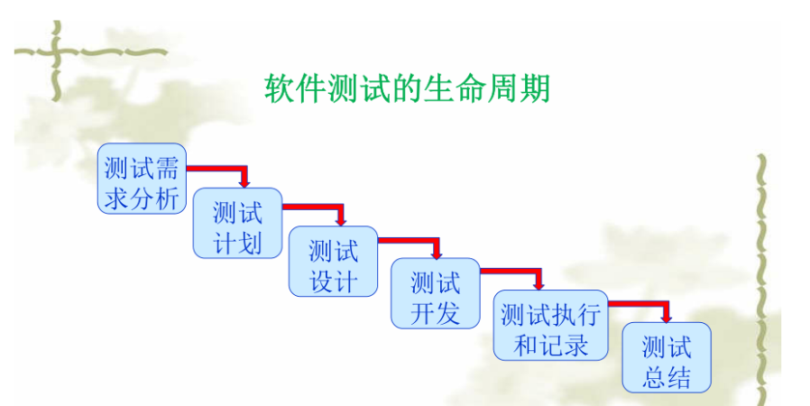

### 软件评审

#### 概述

按照 IEEE 标准，软件评审时软件开发组之外的人员对**软件需求，设计和代码**进行详细审查的评价方法

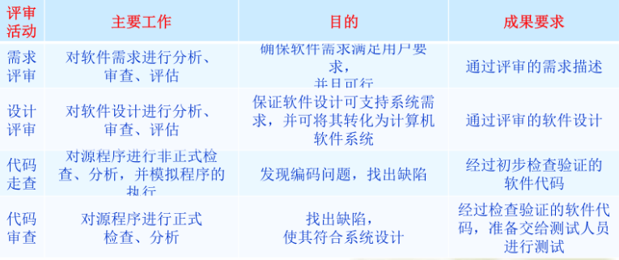

评审小组人员有：组长，评审员，宣读员，记录员，作者

#### 评审会议的一般流程

1. 评审预备：人员和议程介绍
2. 作品介绍和问答
3. 评审决议

评审结束后，评审报告应该包含：会议的基本信息，存在的问题和解决措施，结论和意见，问题跟踪表，问答记录

### 软件质量特性

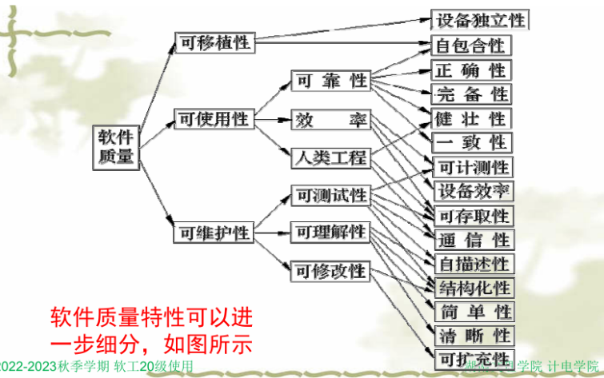

### 软件质量度量：P53

### 软件过程度量：P58

### 软件质量标准：P99

五大标准（p99-p100）

- 国际标准
- 国家标准
- 行业标准
- 企业标准
- 项目标准

能力成熟模型（CMM），五个层次

- 初始级
- 可重复级
- 已定义级
- 已管理级
- 优化级

### 软件评审：P133

### 全面软件质量管理（TQM）：P139
