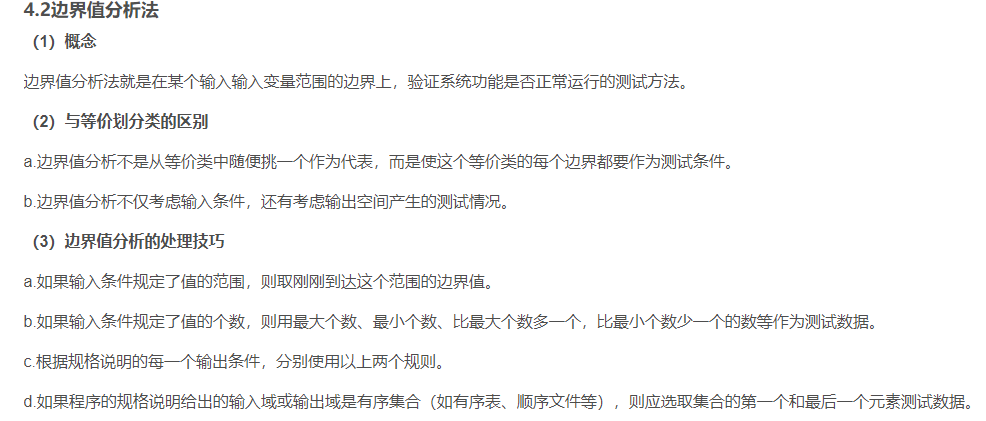
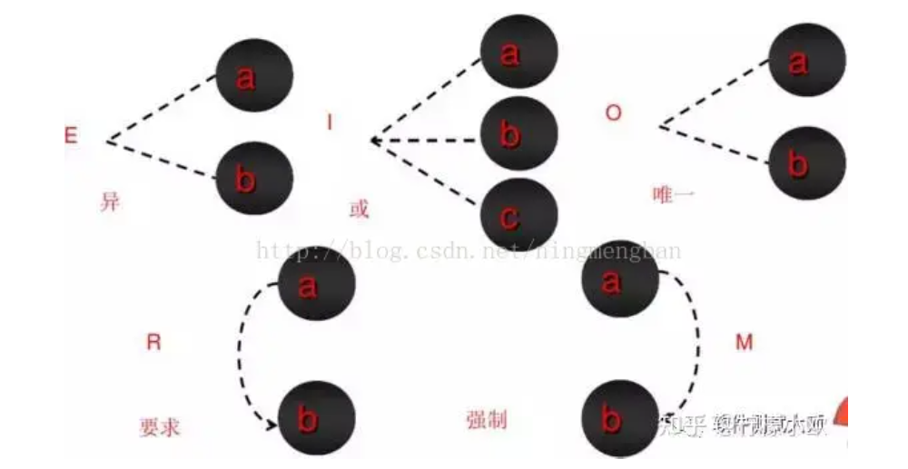

# 测试复习

### 静态测试-动态测试

按照是否被执行可分为**动态测试**和**静态测试**

+ 动态测试：功能确认，接口测试，覆盖率分析，性能分析
+ 静态测试：代码检查，静态结构分析，代码质量度量

> 其中黑盒只有动态测试，白盒有静态和动态

按照是否针对系统内部结构和具体实现算法的角度可分为：黑盒，白盒

### 黑盒测试

+ 等价类：找if，寻找有效和无效等价类，并且为此设计测试用例

+ 边界值分析：基于等价类的条件下，设计测试用例的时候进行采取边界值取法。其中取法规则如下：

  + 例如：0<a<10:取值为 -1，0，1，5，9，10，11 -> 范围边界值，中间值，边界值+-1。七个
  + 例题2：若函数有n个参数，求最少取值：可由上所得 -> 6n + 1（注意：这里n个参数的取值是同一个范围）

  

+ 因果图：找原因 -> 找结果，其中原因附带什么条件可以得出什么结果

  + 约束关系：互斥（E），包含（I），唯一（O），要求（R），屏蔽（M）

    

  + 因果关系：恒等，非（~），与和或

    

+ 状态图：明确状态节点 -> 绘制迁移图 -> 绘制状态迁移树 -> 抽取测试路径
+ 场景法：画流程图 -> 主要事件 -> 备选事件 -> 设计测试用例

后两个更倾向于真实业务测试，也就是功能测试。

> [完美诠释因果图与判定表法 - 知乎 (zhihu.com)](https://zhuanlan.zhihu.com/p/451208514#:~:text=E约束（异）：a和b中至多有一个可能为1，即a和b不能同时为1。 I约束（或）：a、b、c中至少有一个必须为1，即a、b、c不能同时为0。,O约束（唯一）：a和b必须有一个且仅有一个为1。 R约束（要求）：a是1时，b必须是1，即a为1时，b不能为0。 M约束（强制）：若结果a为1，则结果b强制为0。)
>
> [黑盒测试](https://juejin.cn/post/7283797053339353129#heading-9)

------

### 白盒测试

白盒测试可分为**覆盖测试和基本路径测试**。其中**覆盖测试**有

+ 语句覆盖：让每个语句都执行
+ 判定覆盖：每个判断都取一次真假，例如if(a>0 && b>0)，要保证这个if的值取满true和false
+ 条件覆盖：每个条件，指的是if内部的判断取满true，false。同上例子，要a和b这两个判断都取满true，false
+ 条件判定覆盖：前两个的合并。所以他是一定包含了前两个的覆盖
+ 组合覆盖：条件组合情况，例如上面例子，a>0和b>0的两个判断，这时候就需要他们true，false的所有组合
+ 路径覆盖：画流程图，每条路都走

**基本路径测试**

+ 圈复杂度：判断节点 + 1，区域的个数，边 - 节点 + 2
+ 使用步骤：
  1. 画控制图：先画流程图 -> 控制流图
  2. 计算圈复杂度：这个说明需要多少个测试用例
  3. 导出测试用例：按照路径给予测试用例
  4. 写测试用例

> [基本路径测试](https://blog.csdn.net/XU_MAN_/article/details/102963251)

### 集成测试

+ [集成测试_维维sanguine的博客-CSDN博客](https://blog.csdn.net/weixin_45459356/article/details/117034268?app_version=6.1.4&code=app_1562916241&csdn_share_tail={"type"%3A"blog"%2C"rType"%3A"article"%2C"rId"%3A"117034268"%2C"source"%3A"2301_80250292"}&uLinkId=usr1mkqgl919blen&utm_source=app)
+ [集成测试之自顶向下、自底向上、三明治集成-阿里云开发者社区 (aliyun.com)](https://developer.aliyun.com/article/1102979)
